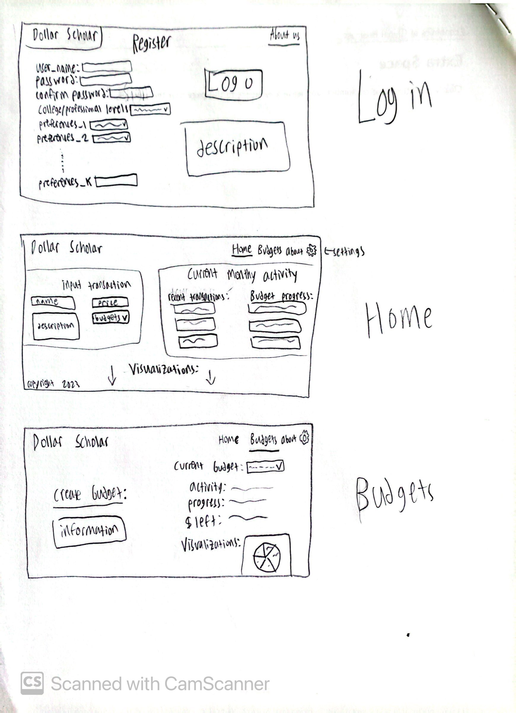
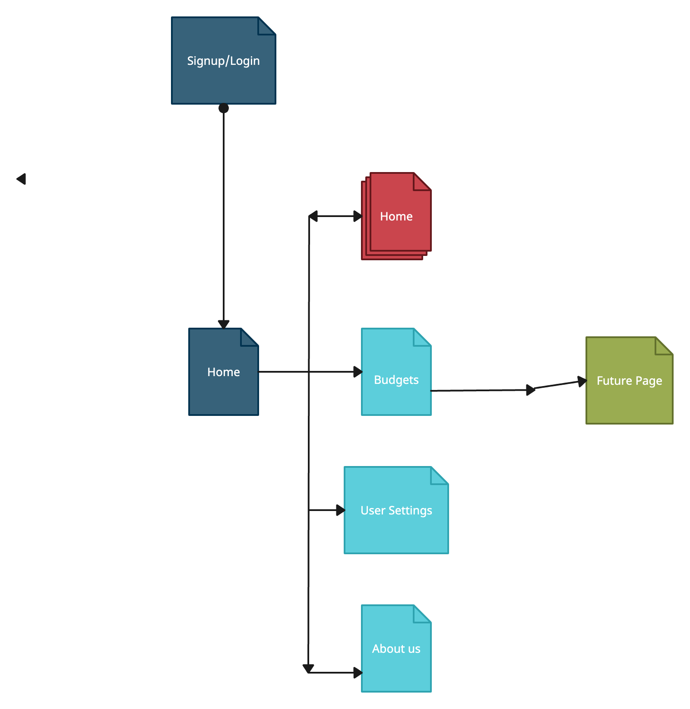

# Dollar Scholar

## Overview


Tracking personal finances as a college student can be messy, time-consuming, and an all-around complicated process. It's too easy to lose track of what your budget is and accidently go way overboard, or alternatively, be paranoid of not spending too much money and worsen your college experience as a result. Alltogether, the personal finance world sometimes seems like a completely opaque realm to college students, and thats where Dollar Scholar comes in. 

Dollar Scholar is a easy-to-use web application that allows users to keep track of all of their personal finance and make/track monthly budgets. Once a user registers, they input their relevant personal information and then the application will tailor an experience with features based around typical college personal finance activity. For example, there will be sections for allowances for food, class material, rent, "extracurricular activities" (which I won't detail here...), etc based on the users personal preferences. Then, users can keep updating their budgets and monthly financial activity, and the applicaiton will keep a holistic overview of each users personal finances, sort financial activity into different sections, and provide financial analysis for each user in an easy to read format.


## Data Model


Dollar Scholar will store users, user preferences (preselected set of fields), monthly and sectional budgets, monthly and/or yearly spending activity lists, and individual financial transcations/activity for each user. 

* users can have multiple budgets and input all their spending activity in transcations, which will update budgets and time based spending lists
* users can also update their preferences and settings at any time, which will automatically update their budgets and other information

An Example User:

```javascript
{
  username: // a unique username,
  hash: // a password hash for security,
  budgets: // array of references to user-created budgets,
  spending_lists: // array of references to spending activity lists
}
```

An example spending list by month for a user:

```javascript
{
  user: // unique username that is linked to this spending list,
  name: // id of spending_list with identifying information,
  month: // month of transactions in the spending list
  items: [ //each item in the following list represents a transaction
    {name: "burrito", price: 15.69, completed: true, budgets: ["food_budget"], logDate: '1/1/1111'},
    {name: "math textbook", price: 100, completed: true, budgets: ["school_stuff", "other"], logDate: '1/1/1111'},
  ],
  logDateTime: // timestamp for when list was last updated
}
```

An Example Budget:

```javascript
{
  user: // user username associated with this budget
  budget_name: // name of budget
  budget_type: // type of budget (what spending activity it accounts for)
  budget_max: // max spending amount(monthly/yearly) of budget
  budget_remaining: //remaining balance in budget (updates when transactions added to spending lists)
}
```

Might also incorporate shopping lists/planners in the future


## [Link to Commented First Draft Schema](db.mjs) 

## Wireframes

Login, home, and budget pages of Dollar Scholar




## Site map

Simple for now, might be expanded later:



## User Stories or Use Cases

1. as non-registered user, I can register a new account with the site and input my preferneces
2. as a user, I can log in to the site whenever I want
3. as a user, I can create new budgets based on my spending activity and adjust their settings
4. as a user, I can create new and modify existing spending activity lists and parameterize them
5. as a user, I can add spending activity transcations that will automatically update spending activity lists and my different budgets
6. as a user, I can remove budgets and transactions if needed, or adjust their details
7. as a user, I can see all my budgets and spending activity lists on one page
8. As a user, I can update my specific preferences and user details, and my budgets/spending insights will automatically update as well


## [Link to Initial Main Project File](app.mjs) 

## Research Topics Integrated Into Project:

1. Functional testing for all routes using Selenium (5 points)

2. Adding data visualizations for user spending/budget data using D3 JS module (4 points)

3. Using tailwind.css (2 points)

## Annotations / References Used


